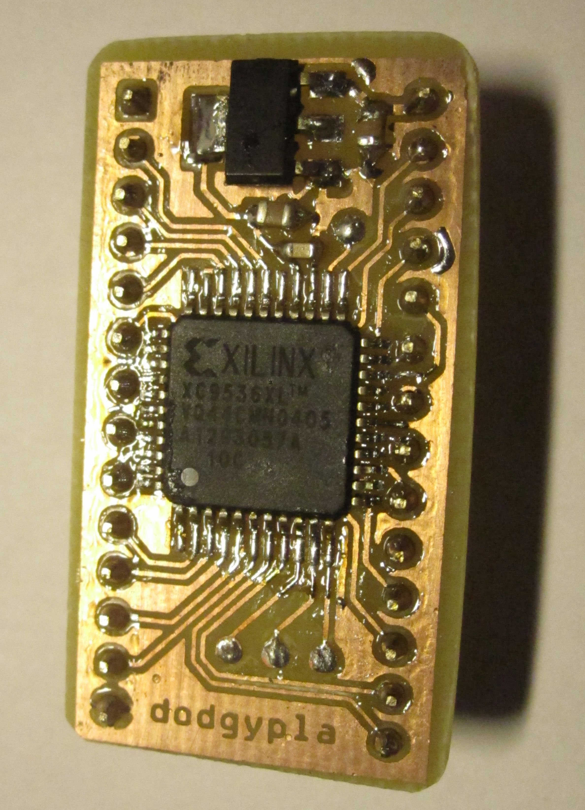

PLA replacement for C64.

Based on the work by skoe:

[https://bitbucket.org/skoe/pla](1)
[http://skoe.de/docs/c64-dissected/pla/c64_pla_dissected_a4ds.pdf](2)

This design uses the Xilinx XC9536XL, which has 5V tolerant inputs essential
for operation with the Commodore 64.

As opposed to skoe's design, the required CASRAM delay is implemented in
Verilog instead of using additional components.

This project includes:

* A Xilinx ISE project written in Verilog for Xilinx XC9536XL
* A KiCad project including a board designed for home etching
